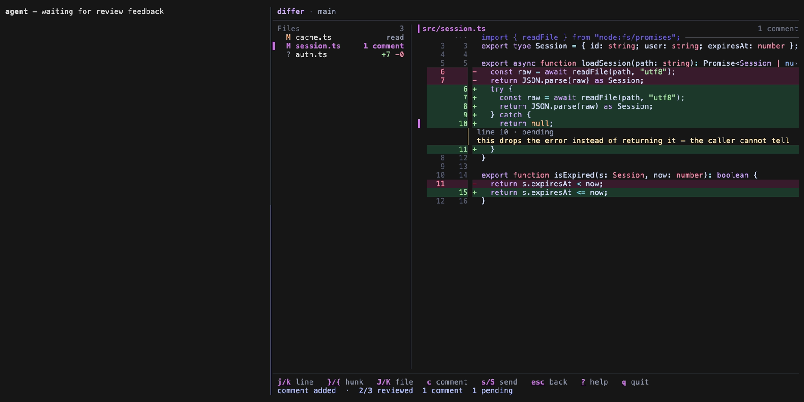

# differ

Terminal UI git diff viewer built with Go and Bubble Tea. Two-panel layout: file list + syntax-highlighted diff preview.

<p align="center">
  
</p>

## Install

```bash
brew install jansmrcka/tap/differ
```

Or via Go:

```bash
go install github.com/jansmrcka/differ@latest
```

Or build from source:

```bash
make build    # → bin/differ
make install  # → $GOPATH/bin/differ
```

## Usage

```bash
differ              # all changes (staged + unstaged + untracked)
differ -s           # staged only
differ -r main      # compare against a branch, tag or commit
differ -c           # open straight into the commit message
differ review       # the same changes, straight into review mode
differ review -s    # review the staged changes
differ log          # browse recent commits
differ commit       # review what is staged, then commit
```

`differ` and `differ review` show the same changes; `review` starts in review
mode, where you can comment line by line and send the result to an agent. Both
take `-s` and `-r`.

`--no-color` turns colour off, as does setting `NO_COLOR` to anything.

Exit codes are predictable enough to script against: **0** success, **1** a
runtime problem (not a git repository, no such ref), **2** a bad command line.
A runtime failure prints one line and no usage block.

## Keyboard Shortcuts

Press `?` in any view for the full list of its keys. The bar along the bottom
shows the common ones for wherever you are, and hides what would not do
anything — `send` only appears once a comment is waiting.

The tables below are checked against the code: a test fails if a key here has
no handler, or a handler is missing from here.

### File List

| Key           | Action                                     |
| ------------- | ------------------------------------------ |
| `j/k`         | navigate files                             |
| `enter` / `l` | view diff                                  |
| `tab`         | stage/unstage file                         |
| `a`           | stage all                                  |
| `r`           | enter review mode                          |
| `c`           | commit (AI-generated message via `claude`) |
| `b`           | open branch picker                         |
| `v`           | toggle split (side-by-side) diff           |
| `e`           | open in editor — differ keeps running      |
| `P`           | push (auto `--set-upstream` if needed)     |
| `F`           | pull (fast-forward only)                   |
| `g/G`         | first/last file                            |
| `q`           | quit                                       |

### Diff View

| Key         | Action                    |
| ----------- | ------------------------- |
| `j/k`       | move line cursor          |
| `}` / `{`   | next/prev hunk            |
| `d/u`       | half page down/up         |
| `g/G`       | first/last line           |
| `n/p`       | next/prev file            |
| `tab`       | stage/unstage             |
| `b`         | open branch picker        |
| `v`         | toggle split diff         |
| `e`         | open in editor at the cursor's line |
| `r`         | enter review mode         |
| `esc` / `h` | back to file list         |
| `q`         | quit                      |

The diff view has a line cursor (`▌`) marking the current line. It is the
anchor review comments attach to, and it keeps the same position when you
toggle between unified and split view.

### Review Mode

Review mode is the diff view with review state on top: it tracks which files
you have looked at and holds your review comments.
It never changes git state — staging and committing stay explicit actions.

| Key       | Action                          |
| --------- | ------------------------------- |
| `r`       | toggle review mode              |
| `j/k`     | move line cursor                |
| `}` / `{` | next/prev hunk                  |
| `c`       | comment on line (edit existing) |
| `C`       | comment on whole hunk           |
| `x`       | delete comment under cursor     |
| `s`       | send comment under cursor       |
| `S`       | send all pending comments       |
| `n/p`     | next/prev file                  |
| `v`       | toggle split diff               |
| `esc`     | back to file list               |

In the comment editor: `ctrl+s` saves, `esc` cancels. Comments are multiline,
shown inline under the line they refer to, and marked `pending` until sent.
They live for the session only — nothing is written to disk or to git.

Quitting with unsent comments asks for confirmation — review state is
session-only, so `q` really does discard them.

### Stale comments

When the agent edits a file you are reviewing, comments follow the line they
were written against rather than a line number. If that line is gone the
comment is marked `stale` (`!`), with the reason shown inline and the file
flagged in the list. Sending stale comments takes a second, explicit press —
feedback about code that no longer exists is never sent by accident. If the
line comes back, so does the comment.

A comment that was already sent is never sent again, even if it later goes
stale because its file left the diff.

### Commit Mode

| Key     | Action         |
| ------- | -------------- |
| `enter` | confirm commit |
| `esc`   | cancel         |

### Branch Picker

| Key             | Action               |
| --------------- | -------------------- |
| type            | filter branches      |
| `↑/↓` / `^j/^k` | navigate             |
| `enter`         | switch branch        |
| `ctrl+n`        | create new branch    |
| `esc`           | clear filter / close |

## AI Commit Messages

When pressing `c`, differ uses `claude -p` (Claude CLI) to generate a commit message from the staged diff. The message is pre-filled in the input — edit or confirm with Enter.

Requires [Claude CLI](https://docs.anthropic.com/en/docs/claude-code) installed. Falls back to empty input if unavailable.

## Themes

```bash
differ --theme dark   # default
differ --theme light
```

Config file: `~/.config/differ/config.json`

```json
{
  "theme": "dark",
  "commit_msg_cmd": "claude -p",
  "commit_msg_prompt": "Write a concise git commit message for this diff:",
  "editor_cmd": "",
  "editor_strategy": "auto",
  "editor_panes": [],
  "editor_target": "session",
  "editor_line_args": "",
  "editor_timeout_ms": 0,
  "editor_probe_timeout_ms": 0,
  "split_diff": false,
  "feedback_target": "clipboard",
  "tmux_target": ""
}
```

`feedback_target` decides where review feedback goes: `clipboard` (default),
`stdout`, or `tmux`. The clipboard target shells out to `pbcopy` on macOS and
`wl-copy`/`xclip`/`xsel` on Linux, so it does the right thing over SSH.

A failed send never discards comments — they stay pending and the error is
shown, so you can fix the target and send again.

## Reviewing agent changes in tmux

The workflow differ is built for: a coding agent in one pane, differ in another.

```text
tmux
├── Claude Code
└── differ
```

```json
{
  "feedback_target": "tmux",
  "tmux_target": ""
}
```

An empty `tmux_target` means the last active pane — in a two-pane layout, and
from a `display-popup`, that is the pane you came from. Set it explicitly to
any tmux pane target (`%12`, `session:window.pane`) to pin it.

Press `r` to review, `c` to comment on a line, `S` to send everything pending.
The payload is pasted into the target pane's prompt using a tmux paste buffer,
so multiline feedback arrives intact.

differ does **not** press Enter for you. The feedback lands in the agent's
prompt and you send it — which means a misconfigured target can never execute
anything. differ also refuses to paste into its own pane.

If tmux is unavailable, the pane is gone, or the target resolves to differ
itself, the send fails with a specific error and your comments stay pending.

### Editor

`e` opens the file under the cursor in your editor. differ keeps running
either way, and from the diff or a review the editor opens at the line the
cursor is on.

**Which editor.** `editor_cmd`, else `$EDITOR`, else `vi`. `$EDITOR` may carry
arguments (`code --wait`). `editor_cmd` supports `{file}` (absolute path),
`{repo}` (repo root) and `{line}`; each is substituted inside a single
argument, so a path containing spaces needs no quoting.

Without an explicit `{file}` in `editor_cmd`, differ adds the line itself for
editors it can check: `+<line>` for `vi`/`vim`/`nvim`/`view`/`nano`, and
`--goto <file>:<line>` for `code`. Any other editor gets the file alone.

`editor_line_args` replaces that table for an editor differ does not know. It
is a whitespace-separated template over `{file}` and `{line}`, used only when
a line is known:

```json
{ "editor_line_args": "{file}:{line}" }     // helix, sublime
{ "editor_line_args": "+{line} {file}" }    // emacs, micro
```

**Where it opens** — `editor_strategy`:

| value | what happens |
|---|---|
| `auto` (default) | reuse an editor already open in this tmux session → else a new tmux window → else take over differ's terminal |
| `reuse` | only reuse; say so when there is nothing to reuse |
| `window` | always a new tmux window |
| `inline` | always take over differ's terminal, and resume when the editor exits |
| `detach` | run the editor in the background and carry on |

Outside tmux `reuse` and `window` are refused with a message rather than
silently downgraded, so a setting that cannot work never looks like it did.

**Reuse** finds a pane in differ's own tmux session that is running
`nvim`/`vim`/`vi`, hands it the file over nvim's RPC socket, and focuses that
pane. Among several candidates, one in differ's own session wins, then one
sitting in this repository, then differ's own window, then the lowest window
index.

Two settings adjust what reuse looks for:

| setting | default | what it does |
|---|---|---|
| `editor_panes` | `["nvim","vim","vi","view"]` | which pane commands count as an editor. Name your own if you run something else in a pane. |
| `editor_target` | `session` | how far reuse reaches: `session` is differ's own, `any` is every session on the machine, or give one session's name. |

`editor_target` defaults to differ's own session on purpose: with an editor
open in every session, anything looser can jump into a different project.
`any` also moves your tmux client to the editor's session, since focusing a
pane in a session you are not attached to would open the file out of sight.

Note that `editor_panes` only decides *which pane* is offered the file —
delivering it still needs nvim's RPC socket, so naming an editor that has no
such socket means reuse finds the pane, cannot reach it, and falls back to a
new window.

Nothing unsaved is ever at risk: differ sends `:drop`, which reuses a window
already showing the file and, when the current buffer is modified, hides it
(with nvim's default `hidden`) or opens a window for the target instead of
overwriting it. differ never sends `:edit!`, and passes nvim's own complaint
straight through if it refuses.

Reuse needs nvim's RPC socket, which nvim creates by default — under
`$XDG_RUNTIME_DIR` on Linux and `$TMPDIR/nvim.$USER/` on macOS. A plain `vim`
has no such socket, so it gets a new window instead.

**Other editors.** VS Code, Zed and Sublime reuse their own window already and
want neither a terminal nor a tmux window — that is what `detach` is for.
differ does not try to guess which editor is which, so tell it:

```json
{
  "editor_cmd": "code -r --goto {file}:{line}",
  "editor_strategy": "detach"
}
```

`-r` makes VS Code reuse its window instead of opening a new one, and leaving
`--wait` off lets it return immediately. The same shape works for others:

```json
{ "editor_cmd": "zed {file}:{line}",  "editor_strategy": "detach" }
{ "editor_cmd": "subl {file}:{line}", "editor_strategy": "detach" }
{ "editor_cmd": "idea --line {line} {file}", "editor_strategy": "detach" }
```

**Timeouts.** `editor_timeout_ms` (default 5000) bounds a tmux command or an
editor open; `editor_probe_timeout_ms` (default 1000) bounds asking a running
nvim which pane it lives in. Raise the second over a slow SSH hop — an nvim
that does not answer in time is simply passed over, and reuse falls back to a
new window.

`detach` starts the editor and leaves it running — it never waits for it, so
a launcher that stays in the foreground (`gvim`, `emacs`, `code --wait`, the
JetBrains launcher with no instance up) is not killed, and one that exits at
once but leaves a GUI process behind does not hold differ up. It is watched
only briefly, so an editor that fails on the spot — a bad flag, a missing
profile — still reports its own stderr in the status bar instead of failing
silently.

An `editor_cmd` that starts with `tmux` runs exactly as written and ignores
`editor_strategy` — it is already a mechanism. So a recipe like
`tmux new-window -c {repo} nvim {file}` keeps working.

## Tips

### Tmux floating window

Bind differ to a key in tmux for quick access as a popup overlay:

```tmux
bind g display-popup -E -w 90% -h 90% "cd #{pane_current_path} && differ"
```

Press `prefix + g` to open differ in a floating window over your current session. It closes automatically on quit.

## Features

- Syntax highlighting via Chroma (Go, JS/TS, Python, Rust, CSS, HTML, JSON, YAML, Markdown, ...)
- Staged/unstaged/untracked file indicators
- Stage/unstage individual files or all at once
- Split (side-by-side) diff view
- Branch picker with type-to-filter and branch creation (`ctrl+n`)
- Push with auto `--set-upstream` for new branches
- Pull with upstream ahead/behind tracking
- Per-file added/deleted line counts in file list
- Open the file under the cursor in `$EDITOR` without leaving differ
- Commit flow with AI-generated messages
- Commit log browser with diff preview
- Compare against any branch/tag/commit ref
- Auto-refresh (2s polling)
- Single binary, no runtime dependencies
